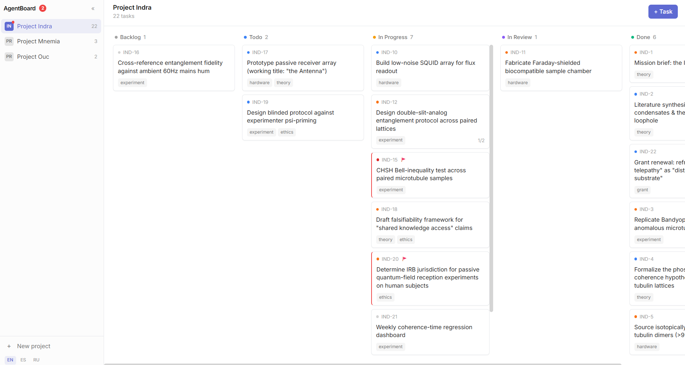
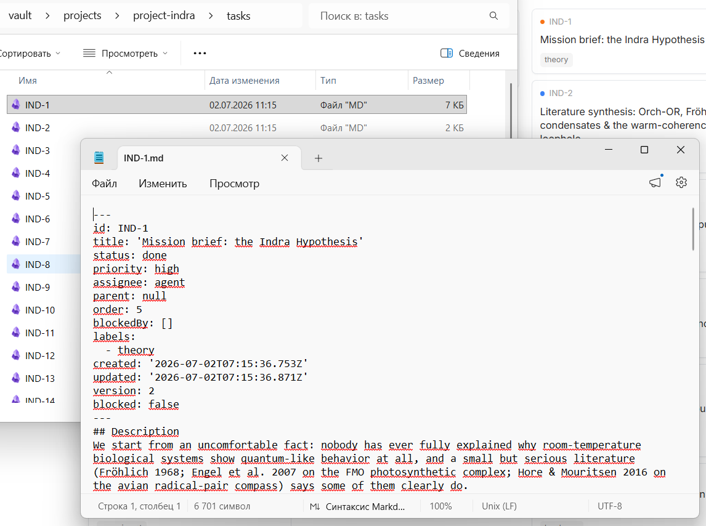
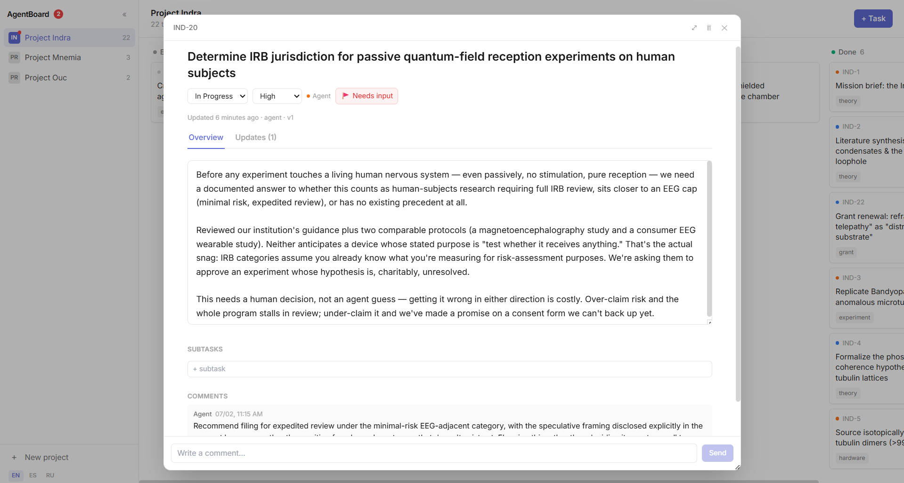

# AgentBoard

[](./LICENSE)


**A local, clean-interface task board built for teams where some of the "engineers" are AI agents working autonomously.**

Your agents already write code, open PRs, and run in loops while you're not watching. AgentBoard is how you see what they did, what they're stuck on, and what's next — without another SaaS tab, and without your task history living inside someone else's database.



## Why this exists

Every existing tracker — the popular ones included — was designed for humans coordinating with humans. Point an autonomous coding agent at one and two problems show up immediately:

- **The agent loses the plot.** A fresh context window has no memory of what it did an hour ago. It either re-derives the whole plan from scratch every session (expensive) or quietly drifts off-task.
- **You lose visibility.** "Done" from an agent and "done" verified by a human look identical in most trackers. When an agent gets stuck mid-task, there's usually no signal at all — it just loops, or gives up silently.

AgentBoard is built around both problems directly, not bolted on after the fact:

- **`get_next_task`** — an agent asks the board what to do next instead of holding the plan in its own context. Survives context resets, session restarts, even a different agent picking up the same project.
- **🚩 Needs-input flag** — independent of status. A stuck agent flags the task and moves on to the next one instead of looping on it. You see exactly which cards need you, at a glance, from the sidebar — no digging through columns.
- **Real version history** — not "last edited 2 hours ago." Every substantive rewrite of a task's description is a checkpoint with a summary of *what changed and why*, so a human catching up after a long autonomous run reads three checkpoints instead of the whole activity log.
- **In Review, on purpose** — a dedicated stage between "the agent thinks it's done" and "a human confirmed it's done," because those are not the same claim, and conflating them is how you stop trusting the board.

## It's just markdown

No database. A project is a folder, a task is a file:

```
vault/projects/<slug>/project.md
vault/projects/<slug>/tasks/<KEY-N>.md
```



Open any task in a plain text editor and you'll see exactly what the UI shows you — frontmatter, description, version history, comments, all in one readable file. Grep it, diff it, back it up with git, sync it with anything that syncs a folder. Nothing about your task history is locked inside this app, and it never will be.

## Task detail, at a glance



- **Overview / Updates tabs** — the current state of the task stays the primary view; version history is one click away, not competing for space.
- **Subtasks** are real entities with their own status, not a checklist — because a subtask an agent is working on deserves its own history too.
- **Comments** are the conversation layer; **Updates** are deliberate checkpoints; **Activity** (status/field changes) is routine bookkeeping, collapsed by default. Three different things, kept visibly separate.

## MCP-native

Point any MCP-compatible agent at the vault and it gets `list_projects`, `get_next_task`, `create_task`, `update_description`, `set_needs_input`, `delete_task`, and more. See [AGENTS.md](./AGENTS.md) for the full tool reference, the file format for direct access when MCP isn't available, and a protocol for agents running long, unattended loop/cycle sessions.

No MCP client handy? The REST API underneath is the same one the UI uses — nothing is UI-only.

## Quick start

After cloning/forking (and after every machine restart, if nothing is running yet):

```bash
npm run setup   # once after cloning: installs dependencies in root and web/
npm run seed    # optional: demo data
npm run dev     # brings up the API server (4173) and frontend (5173) together
```

Open http://127.0.0.1:5173.

For production mode (single process, single port):

```bash
npm run build        # builds web/dist and compiles the server
npm start             # serves everything on http://127.0.0.1:4173
```

### Where the vault lives

By default, `./vault` next to the project. If your vault needs to live somewhere else (a different drive, a folder shared between a repo and its fork), skip repeating an env var every time — create `agentboard.config.json` in the project root (see [agentboard.config.example.json](./agentboard.config.example.json)):

```json
{
  "vault": "C:\\path\\to\\your\\vault",
  "port": 4173
}
```

The file is gitignored — every machine/fork keeps its own. `AGENTBOARD_VAULT`/`PORT` env vars, if set, always take priority over the file.

## Tests

```bash
npm test
```

## License

MIT — see [LICENSE](./LICENSE). Use it, fork it, self-host it, no strings attached.
